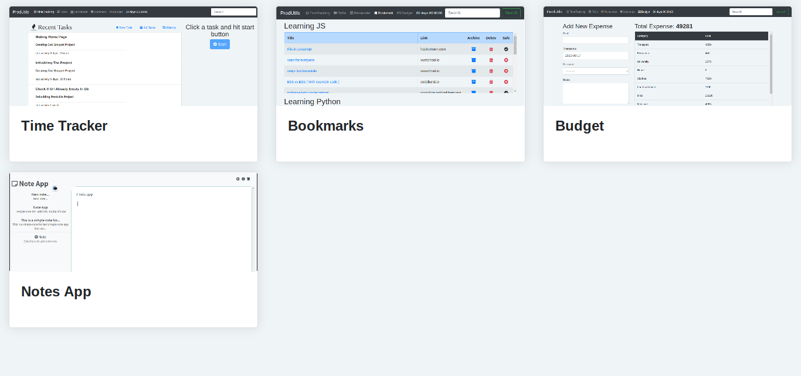
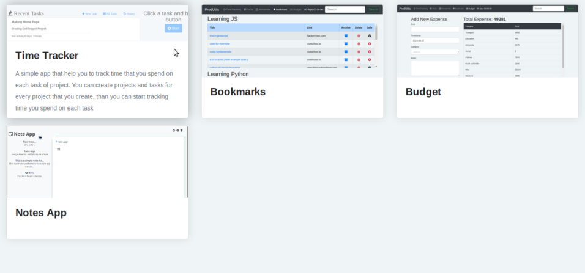
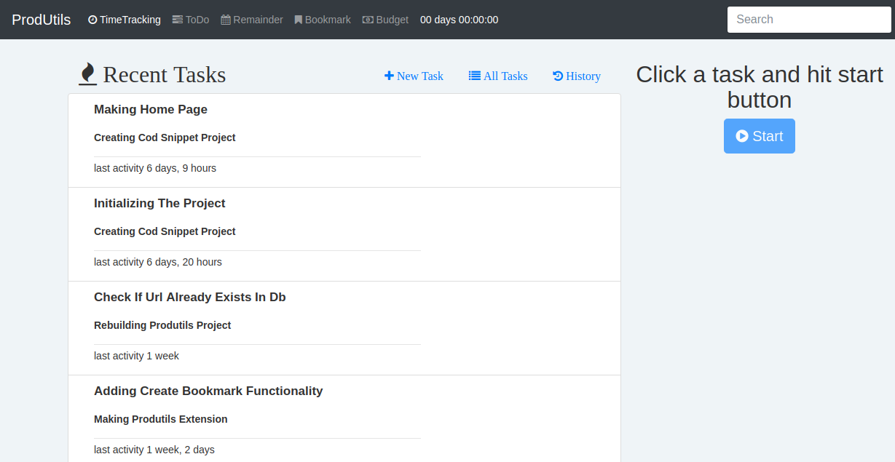
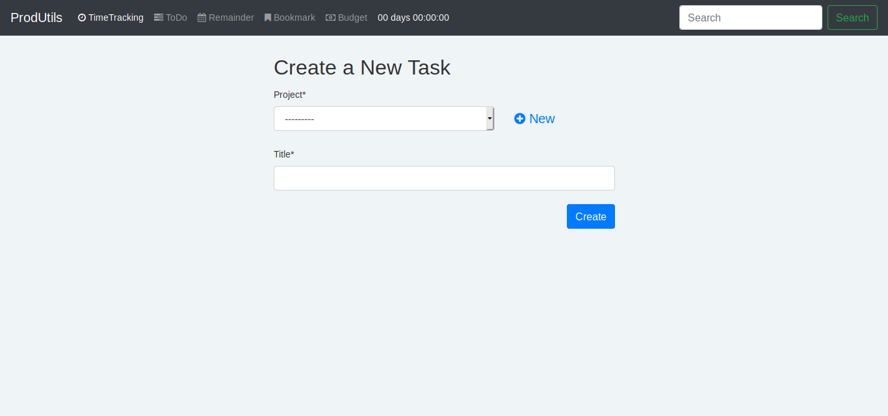
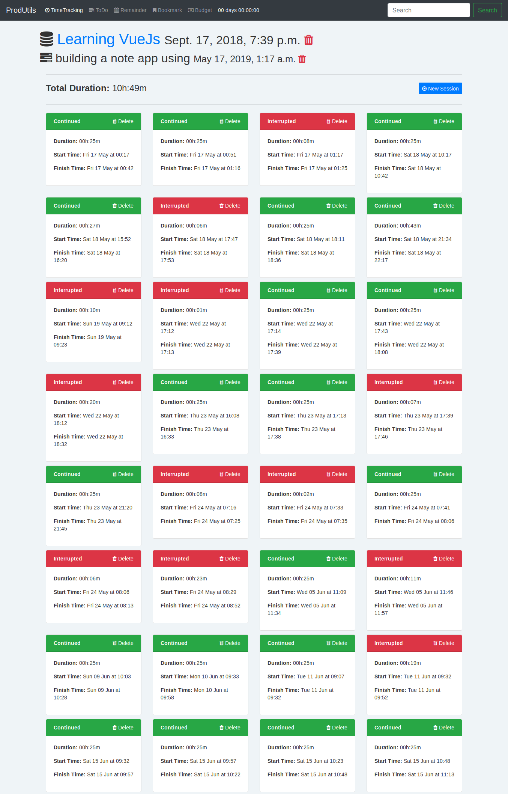

# ProdUtils
ProdUtils is a set of apps that helps you to increase your productivity

# How to run ProdUtils?
Install virtualenv

`$ sudo apt-get install virtualenv`

Create a virtual environment in the root of the project

`$ virtualenv -p python3 env`

Activate the virtual environment

`$ source env/bin/activate`

Install requirements

`pip install -r requirements.txt`

Run development server

`python manage.py runserver`

Access `localhost:8000` in your browser.

# Screenshots

# License
Anyone has the right to use this project in accordance with Islamic law and its values.

